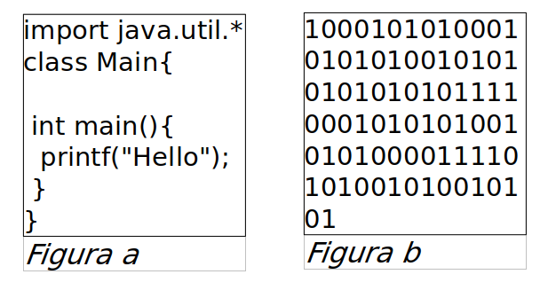

```
Authors: Jordi Gil, Oriol Boix
```

# Activitat 1 - Codi font, codi objecte i codi executable

### Objectius

L’objectiu d’aquest exercici és aprofundir en els coneixements teòrics sobre programes informàtics i llenguatges de programació, especialment en aquells relacionats amb el procés que segueix un programa d'ençà que l'escriu el programador fins que la màquina el pot executar.

### Desenvolupament

Aquesta activitat es desenvoluparà individualment. Pots fer servir els apunts, consultar internet i col·laborar amb companys de cara a rebre suport puntual però, si us plau, redacta les respostes del teu puny i lletra i conforme la teva forma d’expressar-te.


## Exercici 1: codi font
### Característiques

Indica **quines** de les següents característiques es poden relacionar amb el codi font:

    a) Un programador el pot editar i modificar-ne el comportament de forma senzilla.
    b) L'ordinador pot llegir el codi i executar-lo directament.
    c) Els programes com processadors de textos o entorns de desenvolupament els poden interpretar i mostrar per pantalla de forma correcta.
    d) El codi es troba sempre optimitzat per estalviar memòria i temps d'execució.
    e) Existeixen diferents llenguatges de programació per escriure'ls.
    f) El codi és sempre el mateix sigui quina sigui la plataforma sobre la qual s'ha d'executar.

### Representació
Indica quina de les figures representa millor el codi font:




## Exercici 2: codi objecte
### Característiques

Indica **quines** de les següents característiques es poden relacionar amb el codi objecte:

    a) Un programador el pot editar i modificar-ne el comportament de forma senzilla.
    b) L'ordinador pot llegir el codi i executar-lo directament.
    c) Els programes com processadors de textos o entorns de desenvolupament els poden interpretar i mostrar per pantalla de forma correcta.
    d) El codi es troba sempre optimitzat per estalviar memòria i temps d'execució.
    e) Existeixen diferents llenguatges de programació per escriure'ls.
    f) El codi és sempre el mateix sigui quina sigui la plataforma sobre la qual s'ha d'executar.


### Representació
Indica quina de les figures representa millor el codi objecte:


## Exercici 3: codi executable
### Característiques

Indica quines de les següents característiques es poden relacionar amb el codi executable:

    a) Un programador el pot editar i modificar-ne el comportament de forma senzilla.
    b) L'ordinador pot llegir el codi i executar-lo directament.
    c) Els programes com processadors de textos o entorns de desenvolupament els poden interpretar i mostrar per pantalla de forma correcta.
    d) El codi es troba sempre optimitzat per estalviar memòria i temps d'execució.
    e) Existeixen diferents llenguatges de programació per escriure'ls.
    f) El codi és sempre el mateix sigui quina sigui la plataforma sobre la qual s'ha d'executar.

### Representació
Indica quina de les figures representa millor el codi executable:


## Exercici 4: Preguntes

    a) Explica amb les teves pròpies paraules, i amb el màxim de precisió possible, quina és la tasca del "compilador".
    b) Explica amb les teves pròpies paraules, i amb el màxim de precisió possible, quina és la tasca de l'"enllaçador".
    c) Explica amb les teves pròpies paraules, i amb el màxim de precisió possible, quina diferència hi ha exactament entre el codi objecte i el codi executable.