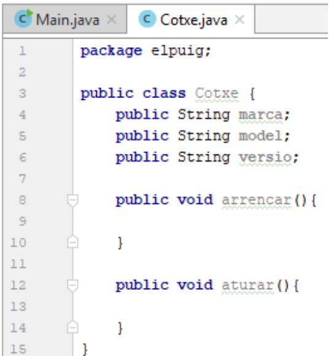
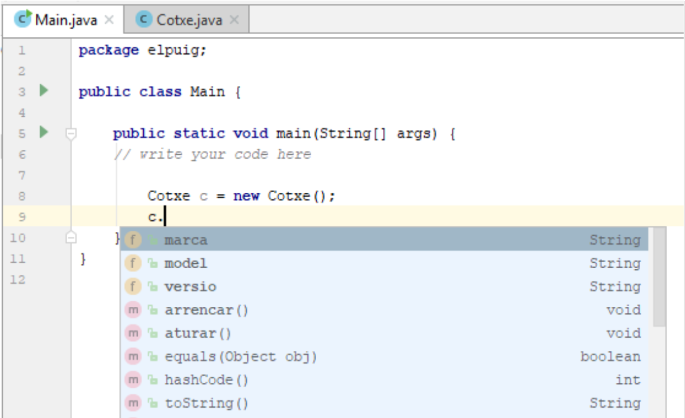
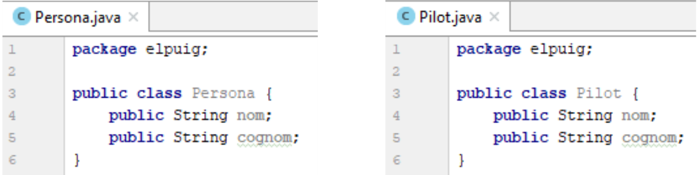
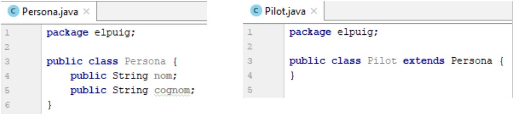
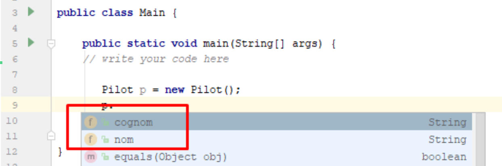
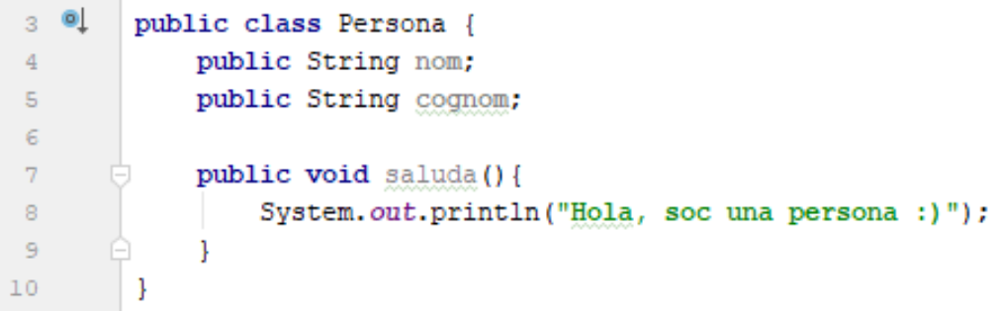
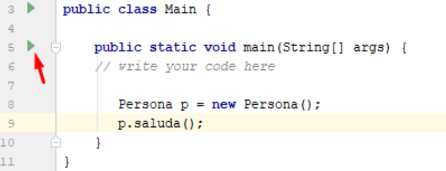
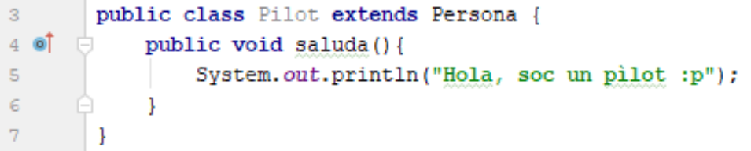
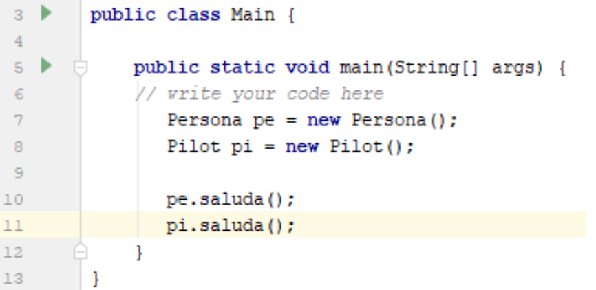
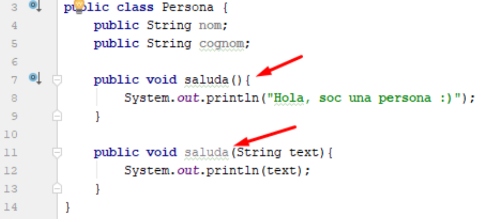

```
Authors: Jordi Gil, Oriol Boix
```

# Activitat 2 - Paradigmes de programació

### Objectius

L’objectiu d’aquest exercici és aprofundir en els coneixements teòrics sobre programes informàtics i llenguatges de programació, especialment en aquells conceptes relacionats amb els diferents paradigmes de programació.

### Desenvolupament

Aquesta activitat es desenvoluparà individualment. Pots fer servir els apunts, consultar internet i col·laborar amb companys de cara a rebre suport puntual però, si us plau, redacta les respostes del teu puny i lletra i conforme la teva forma d’expressar-te.

L’enunciat proposa una sèrie de preguntes amb la intenció que construïu un petit projecte Java  amb el vostre IDE, i amb la finalitat de respondre una sèrie de preguntes relacionades amb els paradigmes de programació orientada a l'objecte i programació funcional.

## Exercici 1: Programació Orientada a l'Objecte
### Fase 0: Preparació

Abans de començar cal que creeu un projecte Java amb Visual Studio Code, tal com s'ha treballat en altres activitats. Com a recordatori aquí teniu una guia per a crear el workspace de java i crear un projecte java:


[VSCode: Workspaces i projectes java](https://github.com/orboan-daw/m051/blob/main/uf1/vscode/vscode-workspaces.md)

> Heu de crear un projecte java anomenat ```m5poo```.


### Fase 1: Abstracció i modularitat

Pensa en alguna cosa que t’agradi o t’interessi (videojocs, música, esports, ciència...) i aplica el concepte d’abstracció per a determinar 3 classes que conformaran el teu model de dades. Per exemple, si trio com a temàtica els cotxes, les classes podrien ser: cotxe; roda; porta.

    1. Quines son les 3 classes que has escollit i per què creus que encaixen amb el model d’abstracció?
→ La teva resposta aquí ← 

    2. Explica amb les teves pròpies paraules què entenem per objecte (dins el paradigma d’objectes) i com es relaciona amb el concepte d’abstracció.
→ La teva resposta aquí ← 

    3. Explica amb les teves pròpies paraules què entenem pel concepte de modularitat.
→ La teva resposta aquí ← 


### Fase 2: Encapsulació


Al projecte java ```m5poo```, de totes les classes que has definit tria i crea la que consideris la classe principal o més important (seguin l’exemple de l’apartat anterior, parlaríem del cotxe) i afegeix-li 3 atributs i 2 mètodes públics tots ells. Per exemple, el cotxe tindria 3 atributs: marca, model i versió; mentre que tindria dos mètodes: arrencar i aturar.

Exemple:



1. Instancia un objecte del tipus que acabes de modificar (amb atributs i mètodes) dins el mètode "main" de la classe "App" i explora el seu contingut amb l’inspector d’objectes. Això ho pots fer fent servir la variable que acabes de declarar seguida d’un punt:



_Nota_: la classe Main a aquesta imatge s'anomena App a vscode.

    2. Hauries de poder veure els mètodes i atributs que has declarat dins el teu objecte (ignora la resta). Sabries dir per que són visibles (i accessibles) des de la classe "App"?
→ La teva resposta aquí ← 

    3. Modifica un dels atributs per a que sigui "private" i torna a repetir el pas anterior, sabries dir que ha canviat i per què?
→ La teva resposta aquí ← 

    4. Els conceptes que acabes de posar en pràctica tenen a veure amb la encapsulació, explica amb les teves paraules en què consisteix aquest concepte.
→ La teva resposta aquí ← 


### Fase 3: Jerarquia

És possible que hagis pensat en una classe que es troba estretament relacionada amb una altra, de tal manera que podríem dir que una **és un tipus de** l'altra. Per exemple, ens podríem inventar dues classes noves: Persona i Pilot: tot pilot **és un tipus de** persona i per tant compartiran informació com es pot veure a l’exemple següent:



Una bona manera de compartir informació es mitjançant l’**herència**, on diem que una classe (classe filla o subclasse) **és d'un tipus d**'una altra (superclasse) i n’_hereta_ la informació de l'altra. Seguint aquest exemple Pilot hereta de Persona, ja que Persona és més genèric i Pilot quelcom més específic:




La classe Pilot està heretant (o estenent) la classe Persona i, per tant, la classe Pilot tindrà els mateixos mètodes i atributs que la classe Persona:





    1. Si no tens dues classes que siguin susceptibles d’heretar una de l’altra, crea-les al teu projecte java, pots fer quelcom tan senzill com el que s’ha mostrat a l’exemple anterior. Quines classes has decidit crear (o ja tenies) i creus que son susceptibles d’encaixar en el model jeràrquic i per què?
→ La teva resposta aquí ← 

    2. Modifica un dels atributs de la classe principal (li direm superclasse) per a que sigui de tipus "private", seguint l’exemple del tutorial instancia una classe secundària (li direm subclasse) i inspecciona els seus atributs. Que ha passat i per què?
→ La teva resposta aquí ← 

    3. El següent quadre mostra la correlació entre les visibilitats (referents a l’encapsulació) dins el seu domini o "scope". Sabries dir què vol dir que un atribut és "protected"?


→ La teva resposta aquí ← 

    4. Una relació de **composició** vol dir que una classe té sentit (existeix) si en forma part d’una altra. Per exemple: les portes i el cotxe; si el cotxe no existeix les portes tampoc tenen sentit i, per tant, si s’esborra la informació del cotxe també s’hauria d’esborrar la informació de les portes.  Sabries dir quina diferència hi ha entre una relació de composició i una relació d’agregació? Pots posar algun exemple de composició i d'agregació al teu projecte java?
    
→ La teva resposta aquí ← 

### Fase 4: Polimorfisme

Si no el tens creat, crea un mètode public a la teva superclasse. No cal que faci res d’especial, com el de l’exemple:



Si executem el mètode des de la classe App i arranquem el programa hauríem de veure la salutació a la consola:



    1. Fes el mateix que s’ha fet a l’exemple però en comptes de fer servir la superclasse (Persona en l’exemple) fes-ho amb la subclasse (Pilot en l’exemple). Quin resultat has obtingut i per què?
→ La teva resposta aquí ← 

    2. Crea un nou mètode a la subclasse que es digui exactament igual que el anterior però que faci quelcom diferent, com suggereix aquest exemple:
    
    

A continuació executa el mètode per a la superclasse (com a l’exemple anterior) i després per a la subclasse que acabes de modificar, com es mostra a l’exemple: 

 

     Que ha passat i per què?
→ La teva resposta aquí ← 

    3. Modifica l'exemple de l'apartat anterior de manera que s'assigni un objecte pilot a una variable de tipus Persona. Executa el mètode saluda() i comprova què passa.
    
    Ara fem-ho al revés: assigna un objecte persona a una variable de tipus Pilot i intenta executar el mètode saluda().
    
    Què passa en ambdós casos i per què?
→ La teva resposta aquí ← 

    3. Ara crea un nou mètode (a la classe o a la superclasse, es indiferent) que es digui exactament igual que el anterior però que tingui una quantitat de paràmetres diferents i, a l’hora, un comportament també diferent com es mostra a l’exemple següent:
    
  
 
      Si fas la prova veuràs que pots executar dos mètodes que es diuen igual però que tenen paràmetres diferents i comportaments diferents. Sabries dir com es diu aquesta característica i quina utilitat pot tindre?
→ La teva resposta aquí ← 
    